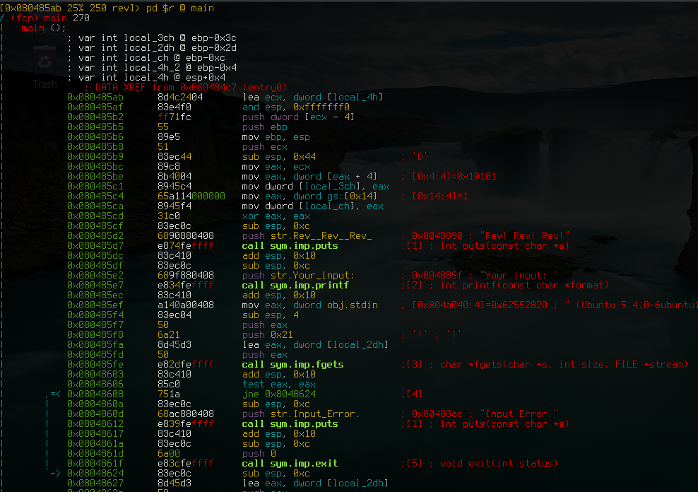
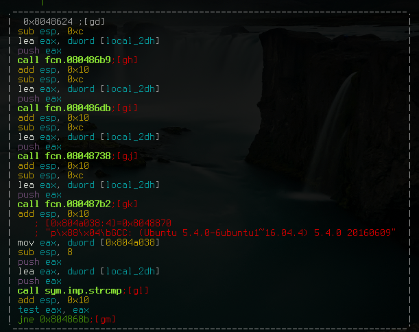

# Rev! Rev! Rev!

## Task

Given binary executable, find the flag in it

## Solution

First of all, we need to examine platform for witch executable was compiled:

```
$ file rev
rev: ELF 32-bit LSB executable, Intel 80386, version 1 (SYSV), dynamically
linked, interpreter /lib/ld-linux.so.2, for GNU/Linux 2.6.32
BuildID[sha1]=e33eb178391bae637823f4645d63d63eac3a8d07, stripped
```

We see that it can run under linux, so let's execute it:


```
$ ./rev
Rev! Rev! Rev!
Your input: hello
Invalid!
```
Now, we understand that executable logic could look like this:


```c
#include <stdio.h>
#include <fcntl.h>
#include <string.h>

int main(void)
{
  char s[1024];
  FILE *stdin;

  printf("Rev! Rev! Rev!\nYour input: ");
  stdin = fdopen(0, "r");
  fgets(s, 1024, stdin);
  if (strcmp(s, "maybe_flag_is_here\n") == 0)
  {
    puts("Success!");
  }
  else
  {
    puts("Invalid!");
  }
  return (0);
}
```
As preferred location of flag was detected, we can examine the binary for flag,
let's look in radare2:

* main function:



You can see in disassembly that program outputs info calling functions puts() and printf(), after that it reads from stdin with fgets() and stores input in local variable `local_2dh`.

* continue of main:



After getting the input, program applies several functions to content of varibale `local_2dh` (you may guess that it is kind of encryption), and later, the most important part, program compares `local_2dh` with some value at address `0x804a038`.

Let's look at this value at runtime.

For this you need to open binary in gdb `$ gdb rev`, and set breakpoint to location of strcmp so we can see two compared pointers in the stack`(gdb) b *0x804866d`.

Now we can run program in debugger:

```
(gdb) r
Starting program: /home/user/ctf/twctf/rev1/rev
Rev! Rev! Rev!
Your input: AAAAA

Breakpoint 1, 0x804866d in ?? ()
(gdb)
```

Read two pointers from stack and check their content:

```
(gdb) x/2wx $esp
0xffffd550:     0xffffd57b      0x08048870
(gdb) p (char*)0xffffd57b
$2 = 0xffffd57b "}}}}}"
(gdb) p (char*)0x08048870
$3 = 0x8048870 "A)\331e\241\361\341\311\031\t\223\023\241\t\271I\271\211\335a1i\241\361q!\235\325=", <incomplete sequence \325>
```

The first pointer is encrypted user input, and the second pointer is posible encrypted flag. As we can see on user input chipher just replace characters by some unknown rule. Because of it, we can try to send hidden value to input and check how it will work.

```bash
$ printf "A)\331e\241\361\341\311\031\t\223\023\241\t\271I\271\211\335a1i\241\361q\!\235\325=\n" > testcase
```
Then run gdb and pipe testcase into binary:

```
gdb rev
(gdb) b *0x804866d
Breakpoint 1 at 0x804866d
(gdb) r < testcase
Starting program: /home/tor/ctf/twctf/rev1/rev < testcase
Rev! Rev! Rev!
Breakpoint 1, 0x0804866d in ?? ()
(gdb) x/2wx $esp
0xffffd550:     0xffffd57b      0x08048870
(gdb) p (char*)0xffffd57b
$1 = 0xffffd57b "CTF{qpzisyDnbmboz76oglxpzYdk}"
```

Got flag!
